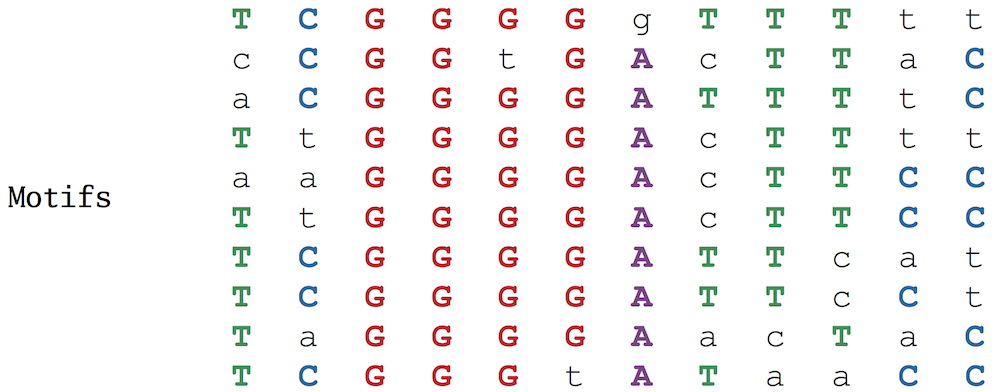
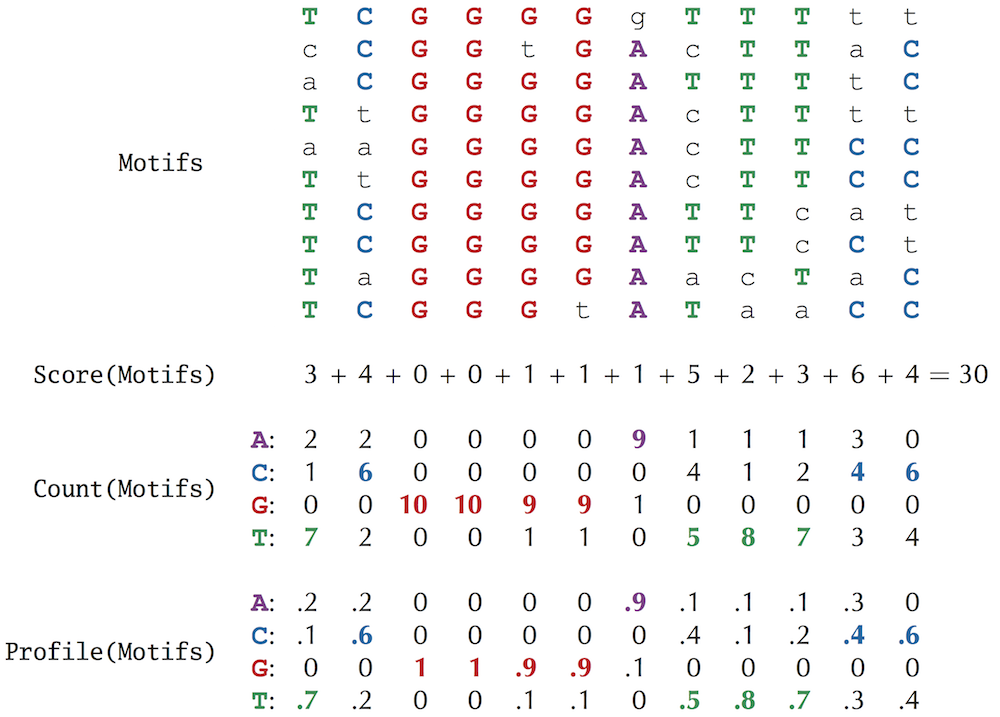
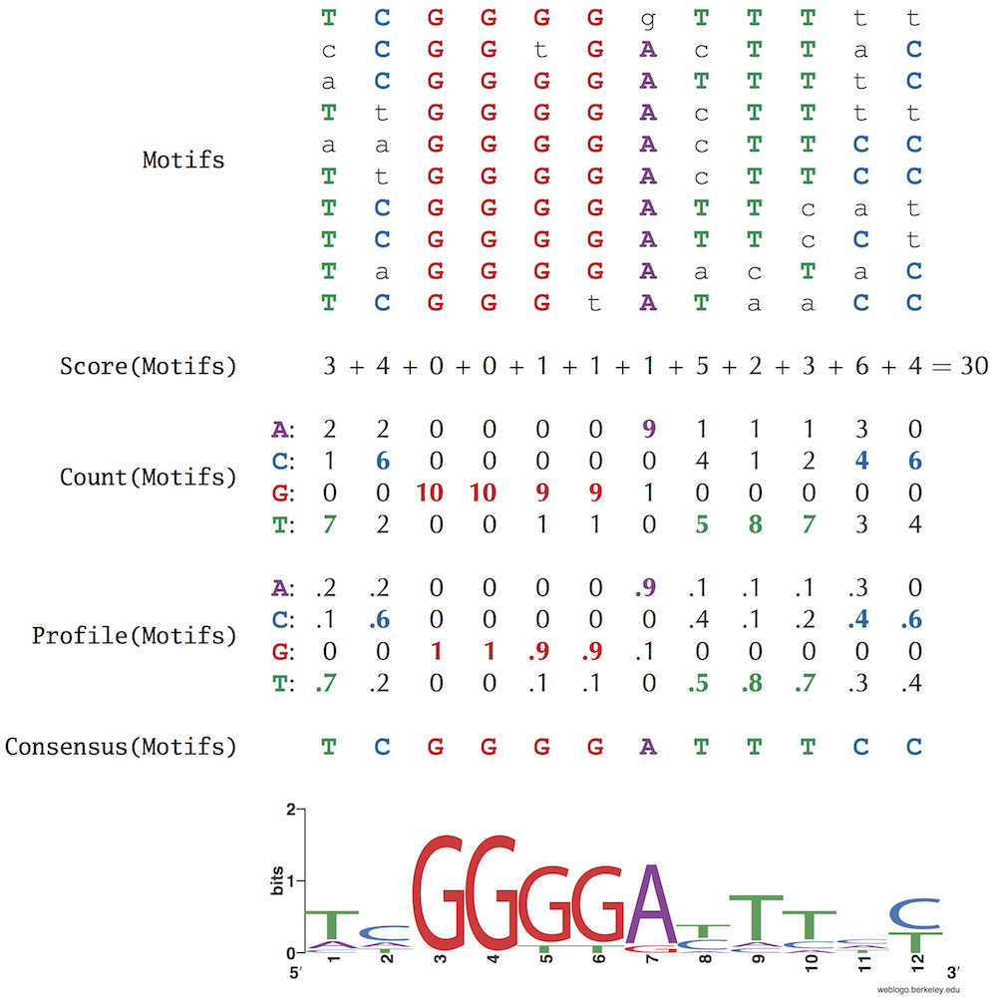
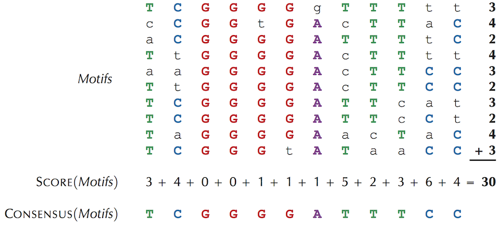

# UCSD_Bioinformatics  
this repo holds my scripts for the UCSD Bioinformatics Specialization on Coursera  

The term k-mer refers to a string of length k. Count(Text, Pattern) is the number of times that a k-mer pattern appears as a substring of Text.  
To compute Count(Text, Pattern), our plan is to "slide a window" down Text. Checking whether each k-mer substring of Text matches Pattern. We will therefore refer to the k-mer starting at position i of Tex as Text(i, k). We use 0-based indexing, meaning that we count starting at 0 instead of 1.   

## The Frequent Words Problem   
We say the Pattern is a most frequent k-mer in Text if it maximizes Count(Text, Pattern) among all k-mers. 
Solving the Frequent Words Problem to find k-mers that appear several times within a window   
- `FrequentWords.r`  
- `PatternCount.r`  
- `reversecomplement.r`  
- `patternmatch.r`  
- `Apply.patternmatch.r`  

## The Clump Finding Problem  
We defined a k-mer as a "clump" if it appears many times within a short interval of the genome. More formally, given integers L and t, a k-mer Pattern forms an (L, t)-clump inside a (longer) string Genome if there is an interval of Genome of length L in which this k-mer appears at least t times. (This definition assumes that the k-mer completely fits within the interval. This also does not take reverse complements into account yet.)    
Clump Finding Problem: Find patterns forming clumps in a string.  
- `ClumpFinding.r`  
- `ApplyClumpFinding.r` 

## Minimum Skew Problem  
Find a position in a genome where the skew diagram attains a minimum.  
Solving the Minimum Skew Problem now provides us with an approximate location of ori   
- `Skew_C_G.r`  
- `locating_ori.r`

## Hamming Distance Problem  
- `HammingDistance.r`  

## Approximate Pattern Matching Problem  
Find all approximate occurrences of a pattern in a string    
- `approx_pattern_matching.r`  
- `count_approx_pattern_matching.r`  

Implement Neighbors to find the d-neighborhood of a string   
To generate the d-neighborhood Neighbors(Pattern, d), the set of all k-mers whose Hamming distance from Pattern does not exceed d.  
- `Neighborhood.r`  

Solve the Frequent Words with Mismatches Problem  
- `FrequentWordsWithMismatches.r`   

Frequent Words with Mismatches and Reverse Complements Problem  
- `FrequentWordsWithMismatchesComplements.r`

Thermotoga petrophila DnaAboxes finder 
- `DnaAboxes_search.r`  

Bibliography Notes  
- [Sedgewick and Flajolet, 2013 gave an overview of various approaches for computing the probabilities of patterns in a string.](https://aofa.cs.princeton.edu/home/)

## Which DNA patterns play the role of molecular clocks  
- What is the expected number of occurrences of a 9-mer in 500 random DNA strings, each of length 1000? Assume that the sequences are formed by selecting each nucleotide (A, C, G, T) with the same probability (0.25). `9-mer.in500randomDNAstrings.1000length.r`   

## A brute force algorithm for motif finding  
Brute force (exhaustive search) is a general problem-solving techinique that explores all possible solution candidates and checks whether each candidate solves the problem. Such algorithms require little effort to design and are guaranteed to produce a correct solution, but they may take an enormous amount of time, and the number of candidates may be too large to check.  
A brute force approach for solving the Implanted Motif Problem is based on the observation that any (k, d)-motif must be at most d mismatches apart from some k-mer appearing in the first string in Dna.  
- `MotifEnumeration.r`  

## Subtle Motif Problem  
- The Subtle Motif Problem refers to implanting a 15-mer with four random mutations in ten randomly generated 600 nucleotide-long strings (the typical length of many upstream regulatory regions). The instance of the Subtle Motif Problem that we will use has the implanted 15-mer AAAAAAAAGGGGGGG and is given below.  [dataset](/Finding_Hidden_Messages_in_DNA/subtle_motif_dataset.txt)

## Scoring Motifs    
A more appropriate problem formulation would score individual instances of motifs depending on how similar they are to an “ideal” motif (i.e., a transcription factor binding site that binds the best to the transcription factor). However, since the ideal motif is unknown, we attempt to select a k-mer from each string and score these k-mers depending on how similar they are to each other.  

To define scoring, consider a list of t DNA strings Dna, where each string has length n, and select a k-mer from each string to form a collection Motifs, which we represent as a t x k motif matrix. In the figure below, which shows the motif matrix for the NF-κB binding sites from the figure below, we indicate the most frequent nucleotide in each column of the motif matrix by upper case letters. If there are multiple most frequent nucleotides in a column, then we arbitrarily select one of them to break the tie. Note that positions 2 and 3 are the most conserved (nucleotide G is completely conserved in these positions), whereas position 10 is the least conserved.   
  

Score(Motifs) is the number of unpopular (lower case) letters in the motif matrix Motifs. Our goal is to find a collection of k-mers that minimizes this score.    

We can construct the 4 × k count matrix Count(Motifs) counting the number of occurrences of each nucleotide in each column of the motif matrix; the (i, j)-th element of Count(Motifs) stores the number of times that nucleotide i appears in column j of Motifs. We will further divide all of the elements in the count matrix by t, the number of rows in Motifs. This results in a profile matrix P = Profile(Motifs) for which Pi,j is the frequency of the i-th nucleotide in the j-th column of the motif matrix. Note that the elements of any column of the profile matrix sum to 1. The figure below shows the motif, count, and profile matrices for the NF-κB binding sites.  
  

# Entropy and the motif logo  
Entropy is a measure of the uncertainty of a probability distribution. In general, the more conserved the column, the smaller its entropy. Thus, entropy offers an improved method of scoring motif matrices: the entropy of a motif matrix is defined as the sum of the entropies of its columns.   

Another application of entropy is motif logo, a diagram for visualizing motif conservation that consists of a stack of letters at each position. We show a motif logo for the NF-kB motif matrix at the bottom. The relative sizes of letters indicate their frequency in the column. The total height of the letters in a column is based on the information content of the column. 
  
- `calculate_entropy.r`   

# The motif finding problem  
Given a collection of strings, fnid a set of k-mers, one from each string, that minimizes the score of the resulting motif.  
A brute force algorithm for the Motif Finding Problem (referred to as BruteForceMotifSearch) considers every possible choice of k-mers Motifs from Dna (one k-mer from each string of n nucleotides) and returns the collection Motifs having minimum score. Because there are n - k + 1 choices of k-mers in each of t sequences, there are (n - k + 1)^t different ways to form Motifs. For each choice of Motifs, the algorithm calculates Score(Motifs), which requires k · t steps. Thus, assuming that k is smaller than n, the overall running time of the algorithm is O(n^t · k · t). We need to come up with a faster algorithm!  

### reformulating the motif finding problem   
Because BruteForceMotifSearch is inefficient, we will think about motif finding in a different way. Instead of exploring all Motifs in DNA and deriving the consensus string from Motifs afterwards: 
Motifs -> Consensus(Motifs)  
we will explore all potential k-mer consensus strings first and then find the best possible collection motifs for each consensus string  
Consensus(Motifs) -> Motifs   
From Motif Finding to Finding a Median String   

To reformulate the motif finding problem, we need to devise an alternative way of computing Score(Motifs). Until now, we have computed Score(Motifs), the number of lower case letters in the motif matrix, column-by-column. For example, we previously computed the score of the NF-κB motif matrix as 3 + 4 + 0 + 0 + 1 + 1 + 1 + 5 + 2 + 3 + 6 + 4 = 30. The figure below illustrates that Score(Motifs) can just as easily be computed row-by-row (3 + 4 + 2 + 4 + 3 + 2 + 3 + 2 + 4 + 3 = 30). Note that each element in the latter sum represents the number of mismatches between the consensus string TCGGGGATTTCC and a motif in the corresponding row of the motif matrix, i.e., the Hamming distance between these strings. For the first row of the motif matrix below, d(TCGGGGATTTCC, TCGGGGgTTTtt) = 3.
  
The motif and score matrices in addition to consensus string for the NF-kB binding sites. Rather than add the non-consensus elements (i.e., lower case nucleotides) column-by-column, we can add them row-by-row, as highlighted on the right of the motifs matrix. Each value at the end of a row corresponds to the Hamming distance between the row and the consensus string.   

- `DistanceBetweenPatternAndStrings.r`    

## The median string problem   
We define Motifs(Pattern, Dna) as a collection of k-mers that minimizes d(Pattern, Motifs) for a given Pattern and all possible sets of k-mers Motifs in Dna.   
Given a k-mer Pattern and a set of strings Dna=(Dna1, ..., Dnat), we define d(Pattern, Dna) as the sum of distances between Pattern and all strings in Dna   
Our goal is to find a k-mer Pattern that minimizes d(Pattern, Dna) over all k-mers Pattern, the same task that Equivalent Motif Finding Problem is trying to achieve. We call such a k-mer a median string for Dna.  
- `MedianString.r`   

## Greedy Motif Search  
In this section, we will explore a greedy approach to motif finding. Again, let Motifs be a collection of k-mers taken from t strings Dna. Recall from our discussion of entropy that we can view each column of Profile(Motifs) as a four-sided biased die. Thus, a profile matrix with k columns can be viewed as a collection of k dice, which we will roll to randomly generate a k-mer. For example, if the first column of the profile matrix is (0.2, 0.1, 0.0, 0.7), then we generate A as the first nucleotide with probability 0.2, C with probability 0.1, G with probability 0.0, and T with probability 0.7.  

A k-mer tends to have a higher probability when it is more similar to the consensus string of a profile.  

Given a profile matrix Profile, we can evaluate the probability of every k-mer in a string Text and find a Profile-most probable k-mer in Text, i.e., a k-mer that was most likely to have been generated by Profile among all k-mers in Text. For example, ACGGGGATTACC is the Profile-most probable 12-mer in GGTACGGGGATTACCT. Indeed, every other 12-mer in this string has probability 0. In general, if there are multiple Profile-most probable k-mers in Text, then we select the first such k-mer occurring in Text.  

- Profile-most Probable k-mer Problem: Find a Profile-most probable k-mer in a string `Profile_most_Probable.r`   

Our proposed greedy motif search algorithm, GreedyMotifSearch, starts by forming a motif matrix from arbitrarily selected k-mers in each string from Dna (which in our specific implementation is the first k-mer in each string). It then attempts to improve this initial motif matrix by trying each of the k-mers in Dna1 as the first motif. For a given choice of k-mer Motif1 in Dna1, it builds a profile matrix Profile for this lone k-mer, and sets Motif2 equal to the Profile-most probable k-mer in Dna2. It then iterates by updating Profile as the profile matrix formed from Motif1 and Motif2, and sets Motif3 equal to the Profile-most probable k-mer in Dna3. In general, after finding i − 1 k-mers Motifs in the first i − 1 strings of Dna, GreedyMotifSearch constructs Profile(Motifs) and selects the Profile-most probable k-mer from Dnai based on this profile matrix. After obtaining a k-mer from each string to obtain a collection Motifs, GreedyMotifSearch tests to see whether Motifs outscores the current best scoring collection of motifs and then moves Motif1 one symbol over in Dna1, beginning the entire process of generating Motifs again.   

- `GreedyMotifSearch.r`  
- substitute zeroes with small numbers called pseudocounts `GreedyMotifSearch_pseudocounts.r`  

## Rolling dice to find motifs      
- `RandomizedMotifSearch.r`  

## How Can a Randomized Algorithm Perform So Well?  
- `How_Can_a_Randomized_Algorithm_Perform_So_Well.r`  

## Gibbs Sampling   

